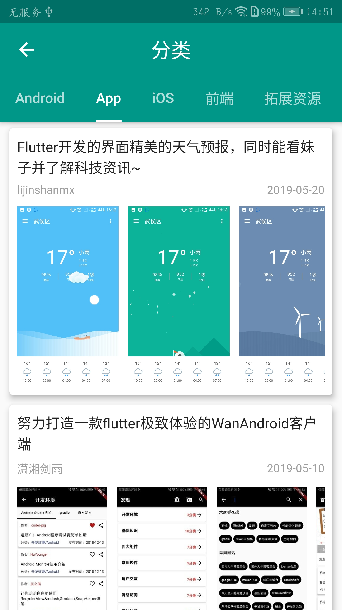
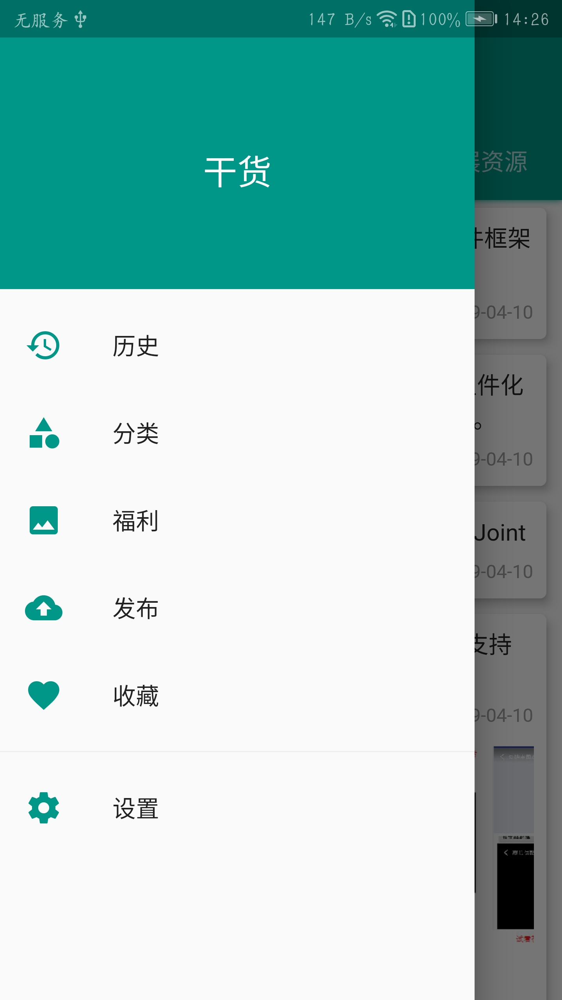
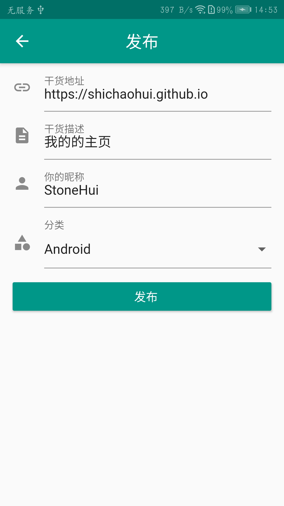
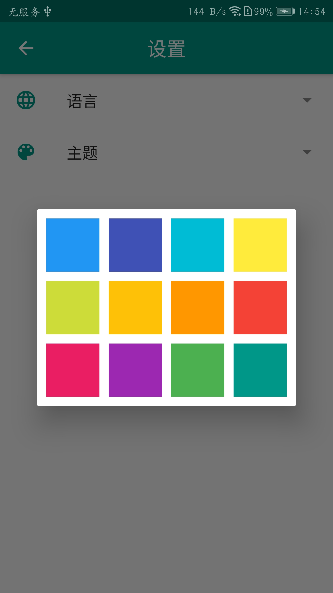
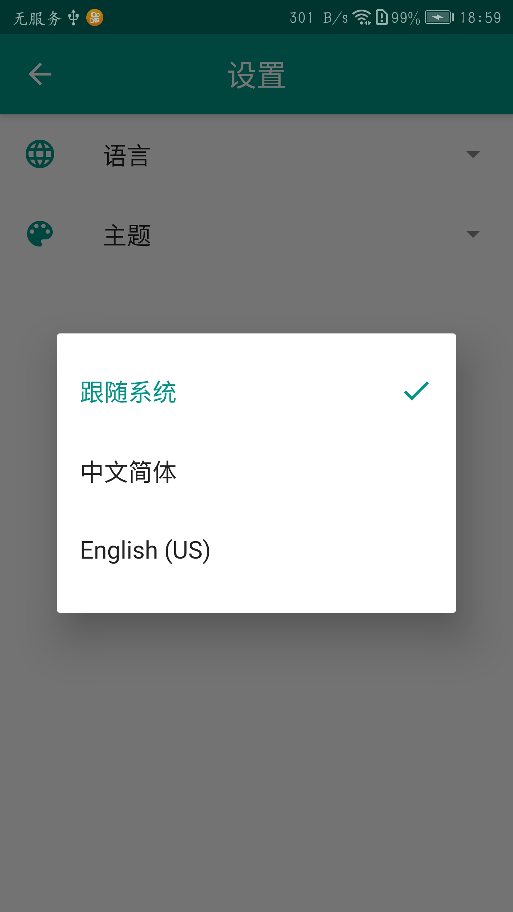

# Gank

A new Flutter application for gank.io .

## Screenshots

|  |  |  |
|----|----|----|
|  |  |  |
|  |  |  |
|  |  |  |

## Features

* The latest ganks
* The history ganks
* Category view ganks
* The welfare images
* Release ganks
* Share ganks
* Favorite ganks
* Switch theme and language
* ...

## Using plugins
* [cached_network_image](https://pub.dev/packages/cached_network_image)
* [flutter_staggered_grid_view](https://pub.dev/packages/flutter_staggered_grid_view)
* [webview_flutter](https://pub.dev/packages/webview_flutter)
* [dio](https://pub.dev/packages/dio)
* [json_serializable](https://pub.dev/packages/json_serializable)
* [shared_preferences](https://pub.dev/packages/shared_preferences)
* [sqflite](https://pub.dev/packages/sqflite)
* [provide](https://pub.dev/packages/provide)
* [intl](https://pub.dev/packages/intl)
* [share](https://pub.dev/packages/share)

## What can you get?

* The basis of flutter.
* Custom zoom box for image or any child widget.
* Refresh and load more of the ListView/GridView.
* Using provide to achieve skin(Theme) switching.
* Using intl to do i18n.
* Using database by sqflite.
* ...

## Licensed

```
Copyright (c) 2015-2019 StoneHui

Licensed under the Apache License, Version 2.0 (the "License");
you may not use this file except in compliance with the License.
You may obtain a copy of the License at

    http://www.apache.org/licenses/LICENSE-2.0

Unless required by applicable law or agreed to in writing, software
distributed under the License is distributed on an "AS IS" BASIS,
WITHOUT WARRANTIES OR CONDITIONS OF ANY KIND, either express or implied.
See the License for the specific language governing permissions and
limitations under the License.
```
